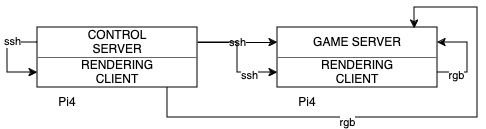
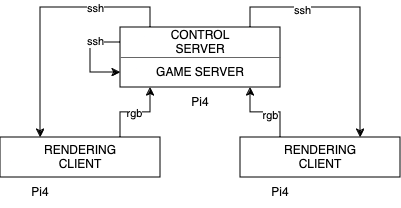
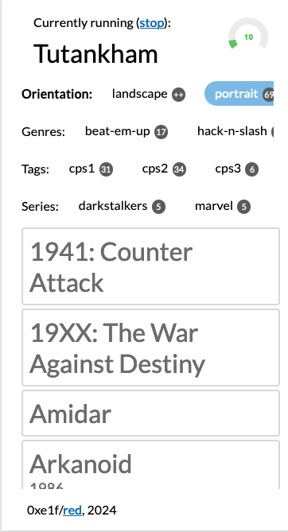
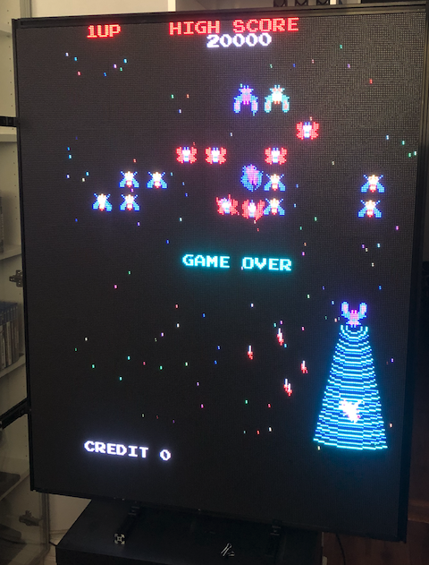
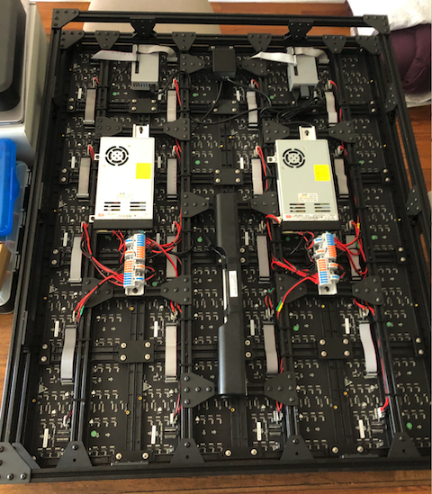

RED (Retro Emulation Display)
===
This project aims to build a 320x256 LED display using 20 64x64 LED panels,
primarily for retro video games. It uses two Pi 4 units to drive each half
of the screen, with one of the units also serving as emulator (producing
sound, capturing input, etc).

## Components

### Electronics
20x [64x64 LED matrix panels](https://www.amazon.com/dp/B0BYJHMFSQ)  
2x [Raspberry Pi 4](https://www.amazon.com/dp/B07TC2BK1X)  
2x [Matrix panel drive board for Raspberry Pi](https://www.electrodragon.com/product/rgb-matrix-panel-drive-board-raspberry-pi/)  
2x [60A Switching power supply](https://www.amazon.com/dp/B07CTWWGGR)  
1x [Rail terminal blocks](https://www.amazon.com/dp/B0BQ6GWW3T)  
1x [Dell sound bar](https://www.amazon.com/dp/B00DEJXRAE)  

### Frame
~5ft [2020 Aluminum extrusions](https://www.amazon.com/dp/B09KZR37KG)  
3x [Slotted aluminum rail](https://www.amazon.com/dp/B0BFFRXW2V)  
2x [Aluminum extrusion connector brackets](https://www.amazon.com/dp/B09DYKMT5F)  
1x [Power supply mounting bracket](https://www.amazon.com/dp/B0C65GLDL8)  

### Other
* An assortment of M3, M4 and M5 bolts and washers
* A number of [3D-printed components](stl)

## Design

The `red` ecosystem recognizes 3 primary sets of components

* Control Server - responsible for managing game states
* Game Server - responsible for emulation, sound, input, etc.
* Rendering Clients - responsible for connecting to Game Server and rendering video

Development is done a workstation and deployed to any of the three via `deploy.py`.
Deploying to Control Server _will_ restart the service; deploying to Game Server and Rendering
clients **will not restart them**.

`red` supports any number of Rendering Clients; each can be configured to display part of
the image generated by the game server. There is nothing preventing Game Service or Control
Service from running on the same unit as the Rendering Client; indeed, Pi 4 is fast enough
to partition work this way. 2 Pis can be partitioned to host Control Server and Rendering Client
on one unit, and Game Server and another Rendering Client on another. Note however, that only
one rendering client can run on any one unit (for speed reasons, as well as GPIO pin availability).

### Network Topology

Two possible network topologies are presented below. Generally speaking, the more
the rendering clients are alike in load, the better - that makes the Three Pi
approach ideal. However, for most games (especially older games), a Two Pi
approach works just as well - especially when rendering clients are 
[set up with a dedicated core](https://github.com/hzeller/rpi-rgb-led-matrix/tree/master?tab=readme-ov-file#cpu-use).

#### Two Pi4s

#### Three Pi4s

### Control Server

[Control Server](ctl_server) is a small Python3 service that produces a basic HTML page and
allows the user to select a game. When a game is selected, Game Server and the Rendering Clients
are restarted.

It's important to note that Control Server is not written with security in mind, and **should not
be open to internet access**.

  

### Communications

There are two sorts of communications in `red`:

* `ssh` - initiated by `deploy.sh` and Control Server
* `rgb` - initiated by rendering clients, when they're asked to connect to game
server

For the former, it's important to 
[set up public key auth](https://www.digitalocean.com/community/tutorials/how-to-configure-ssh-key-based-authentication-on-a-linux-server),
so that `ssh` clients (incl. Control Server) can connect as necessary.

For the latter, no special configuration is necessary; however, a few things to
note:

* Don't use WiFi for RGB connections. Use ethernet connections (more on this later)
* Use IP addresses for RGB connections. At the moment, hostname resolution is not
supported
* Double-check game server IP in `config.yaml`. It should reflect an `eth` address

### Connection Sharing

To enable ethernet port communication, you'll need to set up connection sharing
on the Raspberry Pi. This will need to be done on a unit common to both clients -
usually the unit hosting the Game Server.

To set up connection sharing, follow the steps in 
[this stackexchange post](https://raspberrypi.stackexchange.com/questions/144824/bridging-wifi-to-ethernet-with-networkmanager).

### Game Server

[Game Server](game_servers) is a basic emulator running a "headless" renderer. It displays nothing,
but accepts connections from rendering clients, and will dispatch frames as they become available. 
To keep rendering fast, connections are done to/from eth0 IPs, which may require connection 
sharing on one of the Pi units.

At the moment, [FinalBurn Neo](https://github.com/finalburnneo/FBNeo) is the only server available.

### Rendering Client(s)

[Rendering Clients](rgbclient) connect to a running Game Server and display video based on data supplied by
the game server, combined with information supplied via command-line.

Only one Rendering Client can run on any one unit.

### Images

  

  

---

