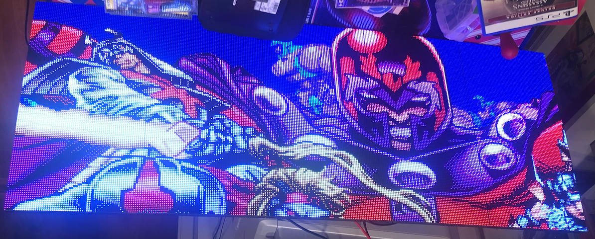

LED
===
This project aims to build a 320x256 LED display using 20 64x64 LED panels,
primarily for retro video games. It uses two Pi 4 units to drive each half
of the screen, with one of the units also serving as emulator (producing
sound, capturing input, etc).

## Components

### Electronics
20x [64x64 LED matrix panels](https://www.amazon.com/dp/B0BYJHMFSQ)  
2x [Raspberry Pi 4](https://www.amazon.com/dp/B07TC2BK1X)  
2x [Matrix panel drive board for Raspberry Pi](https://www.electrodragon.com/product/rgb-matrix-panel-drive-board-raspberry-pi/)  
2x [60A Switching power supply](https://www.amazon.com/dp/B07CTWWGGR)  
1x [Rail terminal blocks](https://www.amazon.com/dp/B0BQ6GWW3T)  
1x [Dell sound bar](https://www.amazon.com/dp/B00DEJXRAE)  

### Frame
~5ft [2020 Aluminum extrusions](https://www.amazon.com/dp/B09KZR37KG)  
3x [Slotted aluminum rail](https://www.amazon.com/dp/B0BFFRXW2V)  
2x [Aluminum extrusion connector brackets](https://www.amazon.com/dp/B09DYKMT5F)  
1x [Power supply mounting bracket](https://www.amazon.com/dp/B0C65GLDL8)  

### Other
* An assortment of M3, M4 and M5 bolts and washers
* A number of 3D-printed components
