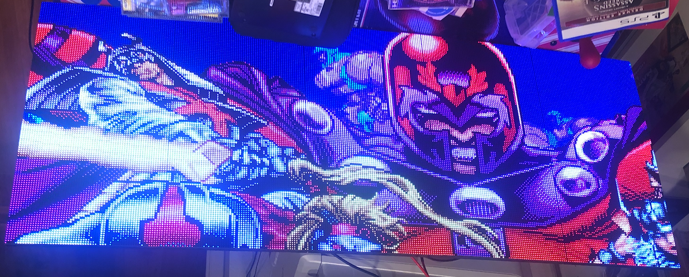
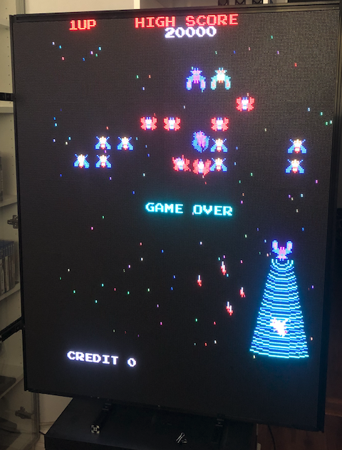
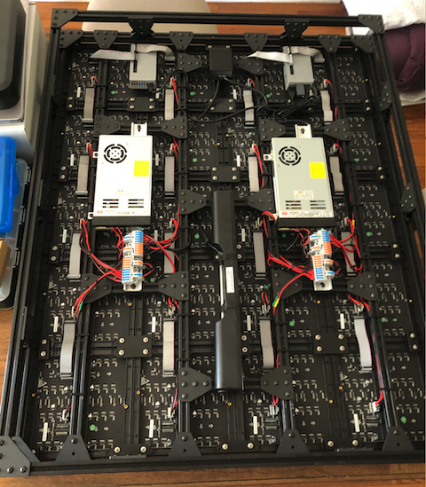

RED (Retro Emulation Display)
===
**red** is a ~4 ft (diagonal) LED matrix made of 20 64x64 panels.
I built it primarily as an art installation, but it is also fully playable.
The project was inspired by large retro-style LED arcade displays at
amusement arcades that often run modified versions of Pac-Man and
Space Invaders.

The current build targets 320x256 pixels, but it can scale to other
resolutions with enough Raspberry Pis and power. Each 320x128 half uses a
60 A AC/DC converter, with peak power draw at high-density or high-brightness
output.

The network layer uses a standard NATS server to publish full-screen frame
data. Subscribers can apply additional scaling as needed. Frames can also be
pre-scaled (for aspect-ratio correction) and are compressed before delivery.

The system runs on two Raspberry Pi 4 units: one runs the emulation
[core](cores)/publisher, and the other runs the [web server](launcher). Both
units drive the display, with one unit handling each half of the screen. The
unit can rotate between portrait and landscape modes, with portrait used mostly
for older arcade games (e.g. Pac-Man).

Emulation is handled by a [custom libretro frontend](pubsub) that manages
input, video, audio, and runtime orchestration.

## Components

### Electronics
20x [64x64 LED matrix panels](https://www.amazon.com/dp/B0BYJHMFSQ)  
2x [Raspberry Pi 4](https://www.amazon.com/dp/B07TC2BK1X)  
2x [Matrix panel drive board for Raspberry Pi](https://www.electrodragon.com/product/rgb-matrix-panel-drive-board-raspberry-pi/)  
2x [60A Switching power supply](https://www.amazon.com/dp/B07CTWWGGR)  
1x [Rail terminal blocks](https://www.amazon.com/dp/B0BQ6GWW3T)  
1x [Dell sound bar](https://www.amazon.com/dp/B00DEJXRAE)  

### Frame
~5ft [2020 Aluminum extrusions](https://www.amazon.com/dp/B09KZR37KG)  
3x [Slotted aluminum rail](https://www.amazon.com/dp/B0BFFRXW2V)  
2x [Aluminum extrusion connector brackets](https://www.amazon.com/dp/B09DYKMT5F)  
1x [Power supply mounting bracket](https://www.amazon.com/dp/B0C65GLDL8)  

### Other
* An assortment of M3, M4 and M5 bolts and washers
* A number of [3D-printed components](stl)

### Images

  

  

---

